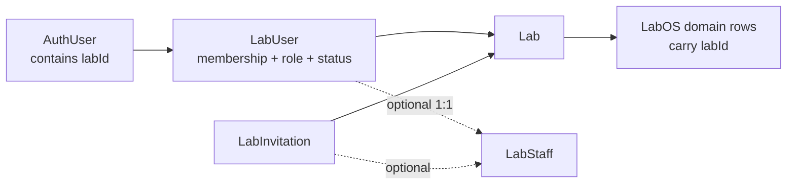
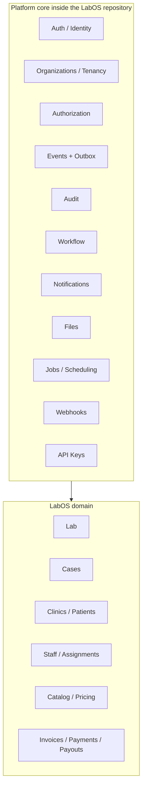
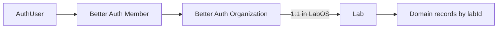
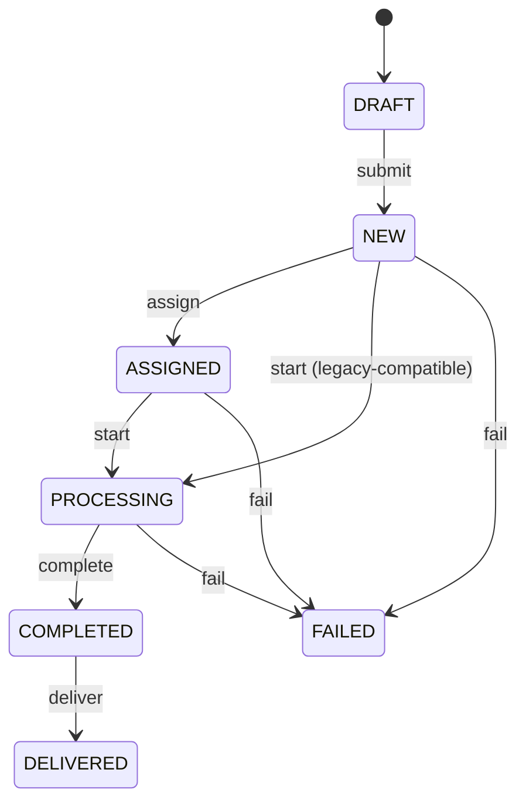

# LabOS platform architecture and migration plan

**Status:** Proposed implementation roadmap
**Scope:** Architecture and migration planning only
**Architecture style:** Modular monolith
**Last reviewed against repository:** 2026-08-21

> [!IMPORTANT]
> This document is the sole architecture baseline for the platform migration. Existing architecture notes, feature plans, and implementation proposals are historical context only and must not be used to design the new platform. Existing code such as `lib/permissions/access-control.ts` describes legacy behavior, is considered obsolete for the target architecture, and remains in place only until its replacement is implemented and verified. Nothing should be deleted merely because it is obsolete.

## 1. Executive summary

LabOS should evolve into a dental-laboratory application built on reusable platform capabilities. The platform should generalize identity, tenancy, authorization, events, audit, workflows, notifications, files, jobs, webhooks, and API keys. It must not generalize dental concepts such as `Lab`, `Case`, `Clinic`, `Patient`, `LabStaff`, catalog, pricing, invoices, or payouts.

The central tenancy decision is:

- **Organization** is the platform membership and security boundary.
- **Lab** is the LabOS business tenant and dental-laboratory record.
- **Platform** is reusable infrastructure consumed by LabOS.

For LabOS V1, one Better Auth Organization maps to exactly one `Lab`. Sessions select an active Organization; the tenancy layer validates membership and resolves it to a `labId`; domain operations continue querying by `labId`. Better Auth owns authentication, organization membership, active-organization selection, and invitation lifecycle. A platform authorization module owns permission decisions. `LabStaff` remains an optional, tenant-specific operational identity and is not a login membership.

The migration must be incremental. Introduce Organization and Member alongside the current `AuthUser.labId`/`LabUser` path, backfill and dual-read temporarily, switch all consumers, and only then remove legacy membership models. Events and audit precede the finite-state workflow engine. Every platform abstraction must first solve a real LabOS requirement.

## 2. Repository reality (current state)

This section describes observed code, not the target architecture.

### 2.1 Identity, tenancy, and onboarding

- Better Auth is configured in `lib/auth.ts` with the Prisma adapter, email/password, admin plugin, and Next.js cookies. The Organizations plugin is not enabled.
- `AuthUser` has Better Auth identity fields plus LabOS-specific `labId` and `AuthUserRole` (`LAB_USER`/`SYSTEM_USER`).
- `Session`, `Account`, and `Verification` use Better Auth-compatible tables. `Session` does not hold active tenant state.
- `createLabAndLabUser` in `actions/lab.ts` creates `Lab`, `LabSettings`, owner `LabStaff`, and owner `LabUser` in one Prisma transaction, then writes the new Lab ID to Better Auth's user record. It does not create an Organization.
- `proxy.ts` treats `session.user.labId` as the onboarding flag. It performs route-level authentication/onboarding routing but not permission authorization.
- `requireLabMiddleware` in `lib/safe-action.ts` trusts `user.labId` only after checking the Lab and a matching active `LabUser`. Its role middleware uses a hierarchy rather than explicit permissions.
- `LabUser.authUserId @unique` means an AuthUser can have at most one `LabUser`, so multi-Lab access is impossible today.
- `LabUser.labStaffId @unique` supports zero or one operational staff link. `LabInvitation.labStaffId @unique` connects the custom invitation lifecycle to a staff record.
- `SuperUser` is a separate one-to-one extension of `AuthUser`; platform administration is therefore conceptually present but not cleanly separated from tenant context.

### 2.2 Domain tenancy and integrity

Most domain tables deliberately store and index `labId`, including Case, Clinic, Dentist, Patient, LabStaff, catalog/pricing, invoices, payments, assets, assignments, and payouts. This is a useful domain ownership key and should remain.

`tenantPrisma(labId)` in `lib/prisma.ts` uses a Prisma query extension to inject `labId` into most reads and writes. It is helpful defense in depth, but its broad “all models except Lab and SuperUser” rule assumes every covered model has `labId`, mutates query arguments generically, and cannot prove that related IDs belong to the same Lab. It must be hardened rather than treated as the sole isolation guarantee.

Several redundant tenant IDs exist without composite foreign keys. For example, a Case carries `labId`, `clinicId`, `dentistId`, and `patientId`, but ordinary foreign keys do not ensure all referenced records share that `labId`. Similar risks exist for invoice/case, work-item/catalog, assignments, and activity records.

### 2.3 Authorization, workflow, and audit

- Server actions declare `requiredLabRole`, and middleware compares `OWNER > MANAGER > ADMIN > STAFF`. This ordering can grant unrelated capabilities merely because one role ranks higher.
- `lib/permissions/access-control.ts` contains UI-oriented capability derivation from `LabRole` and `StaffRoleCategory`; it is not a central server authorization service.
- Existing architecture and feature-plan documents are not inputs to the new design. Where this document mentions them, it does so only to identify legacy repository artifacts that must not control the migration.
- `CaseStatus` currently contains `DRAFT`, `NEW`, `ASSIGNED`, `PROCESSING`, `COMPLETED`, `FAILED`, and `DELIVERED`. QC is commented out.
- `lib/permissions/cases/clinical-status-rules.ts` defines allowed transitions. It has warnings for missing technician/QC/courier, but no generic workflow instance, version, transition history, registered guards, or action registry.
- `CaseActivityLog` is case-specific, stores a `LabUser` actor and name snapshot, and its enum also includes invoice/payment events. This reveals the need for generic audit, but current logs must remain readable during migration.
- There is no platform event bus, outbox, general notification module, or generic workflow engine in the inspected repository.

### 2.4 Current architecture



### 2.5 Current problems

1. Identity, membership, tenant selection, authorization role, operational identity, and activity metadata overlap across `AuthUser`, `LabUser`, and `LabStaff`.
2. One global user cannot belong to multiple labs.
3. Custom membership and invitation code duplicates Better Auth Organizations.
4. Hierarchical role gates are coarse and scattered across actions.
5. Domain services cannot reuse a single authorization decision API.
6. Case changes directly produce case-specific logs; reliable event fan-out is unavailable.
7. Workflow rules are embedded in case-specific code and are not versioned.
8. Application scoping is strong in places but database constraints do not consistently prevent cross-tenant references.

## 3. Target architecture



Use the repository's existing root conventions initially rather than a disruptive folder-only refactor. New code should converge on:

```text
platform/
  auth/
  organizations/
  authorization/
  events/
  audit/
  workflow/
  notifications/
modules/
  labs/ cases/ clinics/ patients/ staff/ catalog/ pricing/ invoicing/
```

Existing `lib`, `actions`, `data`, and `schema` code may move module-by-module when behavior is migrated. Folder movement is not a prerequisite for correctness.

### Dependency rules

1. Platform modules never import LabOS domain models or dental vocabulary.
2. Domain modules may depend on stable platform interfaces, not Better Auth internals.
3. `organizations` may use the Better Auth adapter and a registered Organization-to-domain resolver; its generic core must not query Case, Clinic, or other domain records.
4. `authorization` depends on actor/membership contracts and resource-policy callbacks, not UI components.
5. `workflow` depends on authorization and events through interfaces. It does not send email or mutate arbitrary domain tables directly.
6. Audit and notifications consume events; domain modules do not call every downstream consumer.
7. Cross-module writes occur through exported application services or explicit transactions, not direct access to another module's internals.
8. UI checks improve UX only. Server-side command/query boundaries remain authoritative.

## 4. Organization, Lab, and tenant context



`Organization ID` is the membership/security context. `Lab ID` is the domain ownership and query key. They are intentionally different identifiers.

Add a unique required Organization association to `Lab` after backfill:

```prisma
model Lab {
  id             String @id @default(uuid())
  organizationId String @unique
  // existing Lab fields and lab-owned relations remain
}
```

The exact relation/table names must be generated from the Better Auth version installed at implementation time. Do not hand-maintain a schema that disagrees with the plugin.

Resolve every authenticated LabOS request through one server-only boundary:

```ts
type ActorContext = {
  userId: string
  organizationId: string
  memberId: string
  organizationRole: FixedOrganizationRole
  labId: string
  staffId?: string
  platformAdmin?: boolean
}
```

The exact type may evolve, but consumers must receive verified IDs rather than derive them from arbitrary input:

```text
Session -> active Organization -> validated Member -> Lab.organizationId -> labId
```

An absent active Organization is a tenant-selection/onboarding state, not proof that the user has no memberships. Organization switching changes context and invalidates or keys tenant-specific caches. Never accept a client-supplied `labId` without comparing it to the resolved context.

## 5. Better Auth Organizations and membership migration

### Desired onboarding

```text
Sign up -> create Organization -> creator becomes OWNER Member
        -> create linked Lab + LabSettings/defaults -> set active Organization -> enter LabOS
```

From the product UI, the user creates a dental lab. Organization mechanics remain internal except where switching or membership management is useful.

Organization creation may run through Better Auth APIs while Lab creation runs through Prisma, so a single database transaction may not cover both. Use an idempotent onboarding operation with a stable correlation key and explicit states. On partial failure, retry the missing step or compensate by deleting only a newly created empty Organization. Enforce `Lab.organizationId @unique` and make retries return the existing pair.

### Responsibility mapping

| Current `LabUser` concern | Target owner | Notes |
|---|---|---|
| `authUserId` | Better Auth `Member.userId` | Membership becomes many-to-many across Organizations. |
| `labId` | Member -> Organization -> `Lab.organizationId` | Resolve once into request context. |
| `role` | Platform authorization role bundle, sourced from organization membership | Fixed roles first. |
| `isActive` | Better Auth membership/account policy | Define suspended-member behavior before backfill. |
| `labStaffId` | LabOS staff-account bridge | Must be tenant-aware. |
| `lastTimeActive` | Platform activity/analytics | Do not put it in RBAC; update asynchronously where possible. |
| `isAccountOwner` (referenced by onboarding code/history) | Organization OWNER and billing ownership policy | Verify schema/code discrepancy before migration; current schema excerpt does not define this field. |
| activity-log actor relation | Generic audit actor (`AuthUser`/actor snapshot) | Preserve historical display names. |

### Multi-organization membership

The target permits:

```text
AuthUser -> Member in Organization A -> Lab A
         -> Member in Organization B -> Lab B
```

No direct `AuthUser.labId` or unique global account-to-Lab join may remain in the final state. During migration, a compatibility resolver may dual-read active Organization first and legacy `AuthUser.labId` second, with metrics on fallback use. Dual-write should be short-lived, observable, and removed by a dated exit criterion.

## 6. LabStaff and invitations

`Member` answers “can this account access this Organization?” `LabStaff` answers “what work does this human perform in this Lab?” Owners or accountants may have membership without staff. Staff without login accounts must remain valid.

For the current one-Organization-to-one-Lab model, use a direct optional link keyed to the Better Auth Member:

```text
LabStaff
  labId
  memberId? unique
  member -> Member (onDelete: SetNull)
```

Member identifiers are Organization-scoped, so the same AuthUser can link to different LabStaff records through different Member rows. Do not add `LabStaff.authUserId @unique`. The database enforces the optional one-to-one cardinality, while the tenant-aware integration service validates that the Member belongs to the Organization mapped to the staff record's Lab. Member deletion sets the link to null and preserves operational history. If temporal link history becomes a product requirement, promote this direct relation to a dated bridge table without changing the tenancy contract.

Better Auth Invitation should own email, Organization, requested organization role, status, expiry, token/identifier, and accept/reject lifecycle. LabOS retains only optional staff intent:

```text
LabStaffInvitationLink(invitationId, labId, labStaffId)
```

Acceptance must validate invitation Organization -> Lab and staff `labId`, create/link membership idempotently, then mark the bridge consumed. Do not maintain a second invitation status machine. Retain legacy `LabInvitation` until pending invitations are expired, migrated where supported, or explicitly revoked and reissued.

## 7. Authorization and RBAC

Roles are named permission bundles; permissions are the authorization primitive. `StaffRoleCategory` remains operational classification and never grants application access by itself.

Initial fixed organization roles are `OWNER`, `ADMIN`, `MANAGER`, and `STAFF`. Avoid a numeric hierarchy. Each has an explicit permission set so ADMIN and MANAGER can differ without accidental inheritance. Store bundles in version-controlled TypeScript initially; persist custom roles only after demonstrated customer need.

### Initial permission vocabulary

| Area | Permissions |
|---|---|
| Case | `case.read`, `case.create`, `case.update`, `case.delete`, `case.assign`, `case.submit`, `case.start`, `case.submit_for_qc`, `case.approve_qc`, `case.reject_qc`, `case.fail`, `case.remake`, `case.complete`, `case.deliver` |
| Clinic | `clinic.read`, `clinic.create`, `clinic.update`, `clinic.delete` |
| Patient | `patient.read`, `patient.create`, `patient.update`, `patient.delete` |
| Staff | `staff.read`, `staff.create`, `staff.update`, `staff.deactivate`, `staff.invite`, `staff.assign`, `staff.compensation.read`, `staff.compensation.update` |
| Invoice | `invoice.read`, `invoice.create`, `invoice.update`, `invoice.send`, `invoice.cancel`, `invoice.delete_draft`, `invoice.record_payment` |
| Catalog | `catalog.read`, `catalog.create`, `catalog.update`, `catalog.archive`, `catalog.delete` |
| Payout | `payout.read`, `payout.issue`, `payout.void` |
| Settings | `settings.read`, `settings.update`, `membership.manage`, `billing.manage` |

Before implementation, inventory every `requiredLabRole` action and map it to one or more permissions. Permission names are stable contracts; deletion/voiding, compensation, payment, membership, and billing remain deliberately separate.

### Authorization service

```ts
await authorization.require({
  actor,
  permission: "case.assign",
  resource: { type: "case", id: caseId, labId, assignedStaffIds },
})
```

It evaluates, in order: authenticated actor, active membership, permission bundle, tenant ownership, registered resource policy, then deny/allow. Deny by default. `can` supports UI/query filtering; `require` throws a consistent server error. Both use the same evaluator. Decisions for sensitive mutations should emit structured audit metadata without recording secrets.

### Resource policies

Use ordinary typed policy functions, not a policy DSL. Examples:

- `case.update`: management can update any case in its Lab; operational staff require an active `LabStaffAccountLink` and assignment to that case.
- `case.deliver`: permission plus valid state and, if policy requires, courier assignment/payment condition.
- `staff.compensation.update`: permission plus same-Lab ownership; a user cannot elevate their own organization role unless an explicit owner policy permits it.
- every resource policy first verifies `resource.labId === actor.labId`.

Workflow transition guards enforce domain validity; authorization policies enforce who may attempt the transition. Neither replaces the other.

## 8. Events and reliable delivery

Domain services emit facts after validating commands:

```text
case.created, case.updated, case.assigned, case.status_changed,
case.completed, case.delivered, invoice.created, invoice.sent,
payment.recorded, staff.created, staff.invited, staff.assigned
```

Define a typed event envelope with `id`, `type`, `version`, `occurredAt`, `organizationId`, `labId`, `actorId`, `correlationId`, `resource`, and versioned payload. Payloads contain identifiers and safe snapshots, not whole Prisma entities or secrets.

Begin with an in-process dispatcher interface, but write domain changes and an `OutboxEvent` in the same Prisma transaction for effects that must survive crashes:

```text
BEGIN -> mutate domain row -> insert OutboxEvent -> COMMIT
worker claims event -> invokes idempotent handlers -> marks processed/retries/dead-letters
```

Handlers must be idempotent by event ID and consumer name. Ordering is guaranteed only where explicitly needed, typically per aggregate. No Kafka, RabbitMQ, or service split is warranted.

## 9. Generic audit

Introduce append-only `AuditLog` with at least `id`, `organizationId`, `labId?`, `actorId?`, actor display snapshot, `resourceType`, `resourceId`, `action`, `summary?`, sanitized `payload?`, `correlationId?`, and `createdAt`. Audit is a durable account of meaningful actions, not application debug logging and not the event queue.

Audit consumes domain events and explicit security events. During migration, write generic audit and existing `CaseActivityLog` in the same transaction or derive both from one event. Rebuild the Case Activity UI against `AuditLog` only after parity checks. Preserve existing case logs as historical data or backfill them with deterministic IDs; do not delete them prematurely. Define retention and payload redaction for patient/financial data.

## 10. Workflow Engine V1

Build a reusable, finite-state engine—not BPMN, arbitrary scripting, or a visual builder.

Core concepts:

- `WorkflowDefinition`: stable key and owning application namespace.
- `WorkflowVersion`: immutable published snapshot; drafts may be edited.
- `WorkflowState`: stable state key and terminal flag.
- `WorkflowTransition`: event key, from/to state, required permission, registered guard/action keys.
- `WorkflowInstance`: definition version, domain resource reference, current state, tenant IDs, optimistic version.
- `WorkflowTransitionHistory`: actor, from/to, transition key, result metadata, timestamp, correlation ID.

Published definitions are immutable because existing instances must preserve the rules under which they began. A new definition version affects only new instances unless an explicit, audited instance migration is implemented.

### Conditions, actions, and authorization

Definitions store allowlisted keys and JSON configuration. TypeScript registries map keys to reviewed implementations:

```text
guards: has_assigned_technician, has_qc_assignment, invoice_allows_delivery
actions: sync_case_status, set_completed_at, set_delivered_at, emit_case_event
```

Never store executable JavaScript or SQL. A transition transaction locks/version-checks the instance, validates current state, calls `AuthorizationService` using the transition's permission, evaluates guards, updates instance and domain projection, appends history, and writes outbox events. External side effects happen after commit through event handlers.

### Case as first consumer

Repository reality lacks `QC` and treats missing assignments as warnings. Preserve the current lifecycle for the first compatibility release, then introduce QC only as a separately approved domain change:



Desired later version, after product validation: `PROCESSING -> QC -> COMPLETED`, with QC reject returning to PROCESSING. Remakes remain explicit Case-domain behavior using `originalCaseId`, `isRemake`, `failureReason`, and `failureFault`; the generic engine must not encode dental remake semantics.

Keep `Case.status` as a read-optimized compatibility projection initially. All migrated status mutations go through `WorkflowService`; synchronize `Case.status`, instance state, transition history, and outbox atomically. Reconcile and alert on drift. Remove the projection only if a future measured need justifies the query cost and migration risk.

## 11. Notifications and later platform capabilities

Notifications consume events and accept channel-independent requests with tenant, recipient, template key/version, locale, payload, deduplication key, status, attempts, and timestamps. Email, WhatsApp, and in-app delivery are adapters. Domain code requests “notify invoice sent” rather than calling a provider. Respect `LabSettings` preferences, retry transient failures, and record delivery status without storing provider secrets in payloads.

Future modules should follow the same rule—add them only for a real LabOS consumer:

- Files: tenant ownership, metadata, access policy, storage-provider adapter; first consumer Case assets.
- Jobs/scheduling: outbox processing, overdue invoice sync, notification retries.
- Webhooks: signed, versioned event delivery with retries and tenant-scoped endpoints.
- API keys: hashed secrets, organization scope, permissions, rotation, last-used metadata.

## 12. Platform administration and subscriptions

`SuperUser` represents a platform operator, not an Organization member role. Platform-admin capabilities use a separate actor mode, permission namespace (for example `platform.organization.support_read`), explicit elevation, and comprehensive audit. A platform admin must not silently acquire a Lab's domain permissions. Impersonation, already hinted at by `Session.impersonatedBy`, requires reason, expiry, visible UI indication, original/effective actor IDs, and immutable audit.

`LabSubscriptionPlan` remains a LabOS commercial/entitlement concern. Organization membership answers access; subscription answers plan limits and billing. Link subscription to `Lab` initially because the sold product is LabOS, even though billing customer metadata may later move to a platform billing module. Authorization must not embed plan checks; compose authorization with a distinct entitlement service. Define whether owner transfer changes billing authority without changing subscription ownership.

## 13. Tenant-integrity hardening

Application scoping, authorization, and database constraints are complementary:

1. Resolve `organizationId -> labId` once per request and pass a branded tenant context.
2. Replace the blanket Prisma extension with an explicit allowlist of tenant-owned models and operation tests. Reject conflicting supplied `labId` rather than silently overwriting it.
3. Require `labId` in all tenant-owned unique lookups; avoid unscoped `findUnique` unless the key is globally safe and ownership is checked immediately.
4. Gradually add composite candidate keys and foreign keys such as `(id, labId)` so child-to-parent relationships prove same-Lab ownership. Prioritize Case/Patient/Clinic/Dentist, CaseWorkItem/Product/WorkType, CaseStaffAssignment/LabStaff, Invoice/InvoiceCase/Payment, and audit/workflow resources.
5. Add integration tests that deliberately mix IDs from two Labs across every mutation.
6. Consider PostgreSQL row-level security only after connection/session semantics are designed; do not claim the Prisma extension is RLS.

## 14. Model migration summary

| Model / concept | Target |
|---|---|
| `AuthUser`, `Session`, `Account`, `Verification` | Keep as Better Auth identity; remove Lab-specific tenant pointer from AuthUser. |
| Better Auth `Organization`, `Member`, `Invitation` | Add/use; generated schema is authoritative. |
| `Lab` | Keep; add unique Organization association. |
| `LabUser` | Transitional only; migrate membership, role, staff link, activity fields, then remove. |
| `LabInvitation` | Migrate lifecycle to Better Auth; replace only with minimal staff-invitation bridge if needed. |
| `LabRole` enum | Replace direct checks with fixed platform role bundles; retain temporarily for compatibility. |
| `AuthUser.labId` | Remove after active-Organization cutover. |
| `AuthUserRole` | Review; replace tenant/system split with separate platform-admin capability where possible. |
| `LabStaff` | Keep; operational entity. Link tenant-aware to Member via bridge. |
| `StaffRoleCategory` | Keep unchanged as operational job category. |
| `SuperUser` | Keep temporarily; refactor as platform-admin profile/capabilities and audit its use. |
| `CaseActivityLog` | Keep during dual-write/read validation; migrate to generic `AuditLog`. |
| `CaseActivityType` | Deprecate after audit consumers migrate; event/action strings are versioned vocabulary. |
| `CaseStatus` | Keep initially as workflow projection; add QC only through a product/domain decision. |
| `LabSubscriptionPlan` | Keep separate from membership; later expose through entitlement interface. |
| All dental domain models | Keep domain-specific and retain `labId` where tenant-owned. |
| `OutboxEvent`, `AuditLog`, workflow models | Add in phased migrations. |

## 15. Incremental migration roadmap and definitions of done

### Phase 0 — Baseline and safety

Inventory all role gates, unscoped queries, status writes, invitations, activity writes, and production data shapes. Add two-tenant isolation tests and migration telemetry.

**Done when:** critical paths are enumerated; current behavior has regression tests; backups/rollback and production backfill rehearsal are documented; schema/code discrepancies such as `isAccountOwner` are resolved.

### Phase 1 — Better Auth Organizations schema

Enable the compatible Organizations plugin, generate/reconcile Prisma models, add nullable `Lab.organizationId @unique`, and create an Organization for every existing Lab. Map each existing active LabUser to a Member with the corresponding fixed role.

**Done when:** every Lab has exactly one Organization; every valid legacy member has a Member; duplicates/orphans are reported; backfill is repeatable; no existing login path breaks.

### Phase 2 — Tenant context and active Organization

Implement the central resolver and organization switcher. Dual-read Organization first, legacy Lab second. Key caches by user and active Organization.

**Done when:** users can belong to and switch between multiple Organizations; switching changes `labId`; membership is revalidated server-side; no migrated query derives tenancy directly from `AuthUser.labId`; invalid/stale active organization is safely rejected.

### Phase 3 — Onboarding cutover

Replace `createLabAndLabUser` with idempotent Organization + Lab onboarding and recovery for partial failures.

**Done when:** creating a Lab creates Organization, owner Member, linked Lab, settings/defaults, and active selection; retries do not duplicate records; partial-failure recovery and concurrency are tested.

### Phase 4 — Staff/account bridge

Create and backfill the tenant-aware optional Member-to-LabStaff link; update staff screens and actor-name resolution.

**Done when:** one AuthUser can have different staff records in different Labs; membership without staff and staff without login both work; cross-Lab links are DB/application rejected.

### Phase 5 — Invitations

Send and accept Better Auth Organization invitations, retaining only staff-link intent.

**Done when:** invite lifecycle has one owner; acceptance creates membership and correct optional staff link idempotently; expired/revoked/pending legacy invitations have an explicit disposition; no new `LabInvitation` is created.

### Phase 6 — Authorization V1

Publish permission vocabulary and fixed bundles, implement `AuthorizationService`, resource policies, and adapters for safe actions/API routes. Migrate high-risk financial, membership, staff, and case paths first.

**Done when:** server operations use permission checks; direct `LabRole` conditionals and hierarchy checks are gone from migrated paths; cross-tenant deny tests and assignment-based case policy tests pass; UI consumes the same decision model without being authoritative.

### Phase 7 — Remove legacy membership infrastructure

Make `Lab.organizationId` required; remove fallback writes/reads, `AuthUser.labId`, `LabUser`, `LabInvitation`, and obsolete `LabRole` relations only after usage metrics remain zero through a release window.

**Done when:** no runtime/schema/generated code depends on legacy fields/models; pending data is accounted for; destructive migration is rehearsed and reversible from backup; multi-organization behavior passes end-to-end tests.

### Phase 8 — Events and outbox

Introduce typed envelopes, dispatcher, transactional outbox, and idempotent worker. Start with Case lifecycle events.

**Done when:** domain mutation and outbox insert are atomic; retries and duplicate delivery are tested; handler failures are observable; at least Case completion has two independent consumers without direct coupling.

### Phase 9 — Generic audit

Add AuditLog and event consumer; dual-write or backfill case activity; migrate its UI after parity validation.

**Done when:** Case, invoice/payment, staff invitation, and settings actions are queryable by tenant/resource/actor; payload redaction and retention are documented; historical Case Activity remains available; audit failure policy is tested.

### Phase 10 — Workflow Engine V1

Add immutable versions, states, transitions, instances, history, registry-backed guards/actions, and case adapter. First publish the existing lifecycle; treat QC as a later version.

**Done when:** all migrated Case transitions use WorkflowService; invalid/unauthorized transitions fail; concurrent transitions cannot corrupt state; history persists; registered guards/actions and outbox work; `Case.status` and instance state reconcile with no drift.

### Phase 11 — Notifications

Add notification request/delivery records, templates, preferences, and provider adapters driven by events.

**Done when:** Case completion and invoice delivery use the abstraction; retries/deduplication work; disabled preferences suppress delivery; provider failures do not roll back domain transactions.

### Phase 12 — Integrity and modularization completion

Add prioritized composite tenant constraints and move migrated code behind platform/domain module boundaries.

**Done when:** cross-tenant FK test suite passes; tenant model allowlist is complete; dependency-rule checks find no platform-to-LabOS imports; operational runbooks cover outbox, audit, and tenant repair.

## 16. Risks and mitigations

| Risk | Mitigation |
|---|---|
| Dual membership systems persist indefinitely | Instrument fallback reads, freeze legacy writes by phase, assign an exit release, and block removal until reconciliation is clean. |
| Organization and Lab become inconsistent | Unique constraint, idempotent provisioning state, repair job/report, and atomic local steps with compensation for external API failure. |
| Production backfill loses or mis-roles users | Dry run on a snapshot, deterministic mapping table, orphan report, checksums/count reconciliation, backup and rollback plan. |
| Active Organization leaks cached tenant data | Include organization/lab in every cache key; clear tenant client state on switch; revalidate membership server-side. |
| Cross-tenant foreign keys | Composite constraints in risk order plus hostile two-tenant tests and scoped repositories. |
| `tenantPrisma` gives false confidence | Explicit model allowlist, conflicting-ID rejection, operation tests, and database constraints. |
| Permissions are too coarse or role hierarchy persists | Capability inventory from real actions, sensitive permissions split, deny-by-default evaluator, no numeric hierarchy. |
| Operational roles become security roles | Separate schemas/APIs and tests; `StaffRoleCategory` can be policy input only after membership permission passes. |
| Dynamic RBAC is built prematurely | Fixed code-defined bundles first; record unmet customer cases before adopting the older RBAC v2 proposal. |
| Workflow is over-generalized | Only Case requirements enter V1; typed registries; no DSL, BPMN, scripts, or UI builder. |
| Workflow and `Case.status` drift | One transaction, optimistic locking, reconciliation metric/job, forbid direct status writes. |
| Events and audit duplicate responsibility | Events are integration facts; audit is append-only human/security evidence; define one projection owner and correlation IDs. |
| Outbox handlers duplicate side effects | Consumer/idempotency keys, unique processing records, bounded retries and dead-letter visibility. |
| Staff/account edge cases | Explicitly test staff without accounts, accounts without staff, owners without staff, inactive staff, and one user across multiple Labs. |
| Platform imports LabOS details | Dependency linting and adapter/registration interfaces; reject dental vocabulary in platform APIs. |
| Platform-admin bypass becomes unsafe | Separate permission namespace, explicit elevation/impersonation, expiry, actor pair, and audit. |

## 17. What we should not build yet

- A generic entity/JSON database, low-code product, plugin marketplace, or generic Lab replacement.
- Renaming all `labId` columns to `organizationId`.
- Permanent parallel `LabUser` and Better Auth Member systems.
- Separate authorization paths for APIs and workflows.
- RBAC derived from `StaffRoleCategory`.
- User-defined/dynamic roles before fixed bundles prove insufficient.
- BPMN, visual workflow editing, an ABAC/OPA-style language, arbitrary JavaScript, or arbitrary SQL actions.
- Kafka, RabbitMQ, microservices, a separate platform service/repository, or premature monorepo packages.
- A full notification campaign/marketing system.
- Platform extraction before a second application proves which boundaries are reusable.

## 18. Implementation philosophy and extraction threshold

Build the platform through real LabOS consumers:

| Platform capability | First LabOS proof |
|---|---|
| Organizations | Lab tenancy and switching |
| Authorization | Case, staff, invoice, and settings operations |
| Events | Case lifecycle fan-out |
| Audit | Case Activity plus financial/staff actions |
| Workflow | Dental Case production lifecycle |
| Notifications | Case completion and invoice delivery |

Only after a second product consumes these contracts without dental assumptions should extraction be considered:

```text
Later, if proven:
packages/{auth,organizations,authorization,events,audit,workflow}
apps/{labos,second-product}
```

Until then, keeping platform and domain in one repository and process enables transactional consistency, simpler deployment, and faster evolution.

## 19. Architecture decision log

| ADR | Decision |
|---|---|
| ADR-001 | Organization is the SaaS membership and active-tenant boundary. |
| ADR-002 | Lab remains the LabOS dental-business tenant entity. |
| ADR-003 | Tenant-owned domain tables retain `labId`. |
| ADR-004 | Better Auth owns identity, organization membership, active organization, and invitation lifecycle. |
| ADR-005 | `LabUser` and `AuthUser.labId` are transitional and will be removed after parity. |
| ADR-006 | `LabStaff` is separate from membership and links tenant-aware to Member. |
| ADR-007 | Permissions, not role names or hierarchy, are the authorization primitive. |
| ADR-008 | Fixed role bundles precede dynamic/custom roles. |
| ADR-009 | `StaffRoleCategory` is operational; it is not an authorization role. |
| ADR-010 | Resource authorization uses typed TypeScript policies after tenant and permission checks. |
| ADR-011 | Events use an in-process interface backed by a PostgreSQL transactional outbox for reliable effects. |
| ADR-012 | Audit is generic append-only infrastructure and is distinct from events and debug logs. |
| ADR-013 | Workflow V1 is a versioned finite-state engine with allowlisted conditions/actions. |
| ADR-014 | Case is the first workflow consumer, and its existing lifecycle is migrated before QC is introduced. |
| ADR-015 | `Case.status` remains initially as an atomically synchronized projection. |
| ADR-016 | Subscription/entitlements remain separate from membership and authorization. |
| ADR-017 | Platform administration is separate from Organization roles and requires explicit audited elevation. |
| ADR-018 | Platform remains inside the LabOS modular monolith initially. |
| ADR-019 | Extraction occurs only after a second application proves reuse. |
| ADR-020 | Composite tenant-aware constraints are introduced incrementally, prioritized by risk. |
| ADR-021 | The existing database-managed RBAC v2 proposal is deferred until fixed roles are demonstrably insufficient. |
