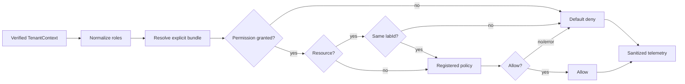

# Authorization V1 and RBAC architecture

**Status:** Proposed for implementation
**Milestone:** M4 — Authorization V1
**Style:** Fixed-role RBAC plus tenant-aware resource policies
**Reviewed:** 2026-08-22

## Purpose

Authorization V1 answers: may this verified Organization member perform this operation on this tenant-owned resource?

Permissions are the stable contract. Organization roles are version-controlled permission bundles. Resource policies handle facts roles cannot express, such as tenant ownership and Case assignment. V1 incrementally replaces the numeric `LabRole` hierarchy and UI-oriented access-control helper. Legacy files remain until M5 removal gates pass.

## Ownership boundaries

Authorization owns the permission vocabulary, fixed bundles, Better Auth role normalization, decisions, denial reasons, resource-policy registry, server adapters, and decision telemetry.

It does not own authentication, membership lifecycle, active-Organization selection, `StaffRoleCategory`, workflow validity, subscriptions, domain mutations, or audit persistence. Better Auth continues authorizing its internal Organization APIs; LabOS Authorization V1 must authorize the product operation before those APIs are called.

| Question | Authority |
|---|---|
| Authenticated and active member? | Better Auth plus `TenantContext` |
| Product role? | Normalized, verified `Member.role` |
| Product operation allowed? | Authorization V1 |
| Resource belongs to tenant? | Mandatory resource check plus tenant-scoped query/mutation |
| Assigned to this Case or allowed to affect this member? | Registered policy |
| Operational job? | `LabStaff.roleCategory`; never an RBAC grant |

## Security invariants

1. Default deny applies to unknown roles/permissions, missing facts, and policy errors.
2. Actor and tenant IDs come only from `requireTenantContext()`; client identity, tenant, and role values are untrusted.
3. Every resource decision checks `resource.labId === actor.labId` before domain policy evaluation.
4. UI capabilities never replace server enforcement.
5. `StaffRoleCategory` grants no application access; `staffId` is only a policy fact.
6. Roles are explicit bundles, never a numeric hierarchy.
7. Authorized mutations still include tenant predicates; authorization is not a replacement for safe data access.
8. Public errors are generic. Internal reasons never expose protected payloads.
9. No cross-request decision cache exists in V1, so membership and role changes apply on the next request.
10. Platform administration is a separate actor mode and is out of tenant V1 scope.

## Contracts

```ts
type AuthorizationActor = {
  userId: string
  memberId: string
  organizationId: string
  labId: string
  memberRoles: readonly OrganizationRole[]
  staffId: string | null
}

type AuthorizationResource = {
  type: ResourceType
  id: string
  labId: string
  attributes?: Readonly<Record<string, unknown>>
}

type AuthorizationRequest = {
  actor: AuthorizationActor
  permission: Permission
  resource?: AuthorizationResource
  context?: Readonly<Record<string, unknown>>
}

type AuthorizationDecision =
  | { allowed: true; reason: 'ROLE_PERMISSION' | 'POLICY_ALLOWED' }
  | { allowed: false; reason: AuthorizationDenialReason }

interface AuthorizationService {
  can(request: AuthorizationRequest): Promise<AuthorizationDecision>
  require(request: AuthorizationRequest): Promise<void>
  capabilities(actor: AuthorizationActor, permissions: readonly Permission[]):
    Promise<Readonly<Record<Permission, boolean>>>
}
```

Better Auth's comma-delimited roles are trimmed, lower-cased, and deduplicated. Recognized roles are `owner`, `admin`, `manager`, and `staff`; temporary Better Auth `member` maps to `staff`. Unknown values are ignored and monitored. If no recognized role remains, the actor receives no permissions. Multiple recognized roles produce the union of their bundles.

## Permission vocabulary

Names use lower-case `<resource>.<action>` strings. They describe operations, never UI pages, HTTP verbs, or roles. Sensitive operations remain separate even if V1 bundles grant them together.

| Area | V1 permissions |
|---|---|
| Case | `case.read`, `case.create`, `case.update`, `case.archive`, `case.assign`, `case.status.transition`, `case.financials.read`, `case.financials.update` |
| Clinic | `clinic.read`, `clinic.create`, `clinic.update`, `clinic.archive` |
| Dentist | `dentist.read`, `dentist.create`, `dentist.update`, `dentist.archive` |
| Patient | `patient.read`, `patient.create`, `patient.update`, `patient.archive` |
| Catalog | `catalog.read`, `catalog.create`, `catalog.update`, `catalog.archive`, `catalog.delete` |
| Staff | `staff.read`, `staff.create`, `staff.update`, `staff.deactivate`, `staff.schedule.update`, `staff.assign`, `staff.access.invite`, `staff.access.revoke`, `staff.compensation.read`, `staff.compensation.update` |
| Invoice | `invoice.read`, `invoice.create`, `invoice.update`, `invoice.cancel`, `invoice.delete_draft`, `invoice.payment.record`, `invoice.overdue.sync` |
| Payout | `payout.read`, `payout.issue`, `payout.void` |
| Settings | `lab.settings.read`, `lab.settings.update` |
| Membership | `membership.read`, `membership.role.update`, `membership.remove` |
| Billing | `billing.read`, `billing.manage` |

New permissions require review of role assignment, resource policy, audit sensitivity, tests, and migration mapping. Renaming/removal is a contract change.

## Fixed bundles

V1 stores immutable bundles in TypeScript and introduces no authorization tables or Prisma migration. Custom roles and member overrides are deferred until proven necessary.

| Capability | Owner | Admin | Manager | Staff |
|---|:---:|:---:|:---:|:---:|
| Ordinary tenant reads | Yes | Yes | Yes | Yes, policy-scoped |
| Create/update Cases and clinical records | Yes | Yes | Yes | No |
| Assign staff/manage Case workflow | Yes | Yes | Yes | Assigned transition only |
| Case financials | Yes | Yes | Yes | No |
| Catalog create/update/archive | Yes | Yes | Yes | Read only |
| Supported Catalog hard delete | Yes | No | No | No |
| Staff create/update/deactivate/schedule | Yes | Yes | Yes | No |
| Invite/revoke/update member roles | Yes | Yes, owner safeguards | No | No |
| Compensation | Read/write | Read | Read/write | No |
| Invoice/payment | Full | Full | Full | Read only |
| Payout | Full | Read | Full | No |
| Lab settings | Full | Full | Read | No |
| Billing | Full | Read | Read | No |

These become explicit `Set<Permission>` values, not calculated inheritance. Any intentional difference from current behavior must be recorded and approved in the migration inventory.

## Decision pipeline



Order is fixed: validate request, normalize roles, resolve bundle, deny absent permission, verify tenant ownership, run policy, deny missing/error facts, record telemetry, return.

## Required V1 policies

| Policy | Rule |
|---|---|
| Tenant ownership | Every supplied resource belongs to actor `labId`; always first. |
| Assigned Case | Staff needs active `staffId` and an active same-Lab assignment for staff-level Case reads/transitions. |
| Case transition | Determines who may request it; Workflow later determines whether the transition itself is valid. |
| Membership target | Same Organization; only owner affects owner; last owner cannot be removed/demoted; self-target flows are explicit. |
| Staff target | Same Lab; linked Member, if present, belongs to the active Organization. |
| Financial target | All referenced Invoice, Case, Clinic, Staff, assignment, and payout records resolve to actor Lab. |
| Draft deletion | `invoice.delete_draft` additionally requires current draft state. |

Fact loaders are tenant-scoped, select minimal columns, and reuse facts within a request. Mutable security facts should be revalidated in the mutation transaction when practical.

## Error and monitoring contract

Internal reasons are `AUTHZ_ACTOR_INVALID`, `AUTHZ_ROLE_UNRECOGNIZED`, `AUTHZ_PERMISSION_NOT_GRANTED`, `AUTHZ_RESOURCE_REQUIRED`, `AUTHZ_TENANT_MISMATCH`, `AUTHZ_POLICY_DENIED`, `AUTHZ_POLICY_FACT_MISSING`, `AUTHZ_POLICY_FAILED`, and `AUTHZ_OWNER_INVARIANT`.

Emit `platform.authorization.decision` with outcome, reason, permission, normalized roles, Organization/Lab IDs, resource type, correlation ID, and duration. Never record resource payloads, patient data, invitation tokens, credentials, financial amounts, or free-form input. Metrics cover outcomes, denials, unknown roles, tenant mismatch, shadow divergence, and role-only/policy latency. Sample ordinary successful reads; retain high-risk denials and membership/financial/destructive decisions.

Engineering targets to validate are role-only p95 below 2 ms in process and policy evaluation p95 below 25 ms excluding handler work.

## Server integration

Create a permission-aware safe-action client whose metadata requires `permission: Permission`. It runs after authentication and tenant resolution. Public/session-only actions use distinct clients, not `permission: null`. During cutover, legacy and permission metadata may coexist, but a declared V1 permission is never silently replaced by a role decision.

Routes call the same service. Pages may use batched role-only capabilities for rendering, while underlying commands remain protected. Domain services accept verified actor context or enforce at their application boundary; they never accept a raw client role.

```text
platform/authorization/
  index.ts
  authorization.types.ts
  permissions.ts
  roles.ts
  role-normalizer.ts
  authorization.error.ts
  authorization.monitor.ts
  authorization.service.ts
  policies/
  adapters/
```

The generic platform kernel must not import Prisma-generated LabOS models. LabOS fact loaders and registrations live in an integration layer.

## Migration

Current baseline: 131 `requiredLabRole` declarations in `actions/` — 55 Staff, 52 Admin, 14 Manager, 6 Owner, and 4 null. Routes, pages, readers, services, file access, and UI checks also require inventory.

1. Add vocabulary, bundles, normalizer, service, telemetry, and tests without consumers.
2. Add permission middleware and policy registry alongside the legacy gate.
3. Inventory every protected server entry point.
4. Shadow-evaluate representative paths and measure divergence.
5. Enforce membership/access first, then finance/destructive actions, then Case/Staff policies, then remaining operations.
6. Replace UI capability projections only after server enforcement.
7. Prove zero runtime legacy consumers before M5 deletion.

Rollback is per slice: restore its still-present legacy enforcement. Never disable both V1 and legacy enforcement. No database migration is planned; if schema work emerges, stop and request user approval.

## Tests and definition of done

- [ ] Vocabulary and bundle matrix are approved.
- [ ] Every role/permission pair and role-normalization edge case is tested.
- [ ] Default deny, policy failure, tenant mismatch, and sanitized monitoring are tested.
- [ ] Assigned/inactive Staff, owner invariants, financial links, and invoice state are tested.
- [ ] Two-Organization tests reject foreign resources and verify role changes on the next request.
- [ ] All 131 declarations and all non-action boundaries are inventoried and migrated/classified.
- [ ] Every covered server operation uses the single evaluator.
- [ ] No migrated path uses numeric hierarchy or UI-only authorization.
- [ ] Decision performance and shadow divergence are observable.
- [ ] Legacy artifacts remain only as documented compatibility code for M5.
