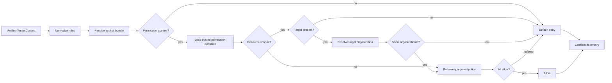

# Authorization V1 and RBAC architecture

**Status:** Implementation in progress — kernel complete, adapters pending
**Milestone:** M4 — Authorization V1
**Style:** Fixed-role RBAC plus tenant-aware resource policies
**Reviewed:** 2026-08-22

## Purpose

Authorization V1 answers: may this verified Organization member perform this operation on this tenant-owned resource?

Permissions are the stable contract. Organization roles are version-controlled permission bundles. Resource policies handle facts roles cannot express, such as tenant ownership and Case assignment. V1 incrementally replaces the numeric `LabRole` hierarchy and UI-oriented access-control helper. Legacy files remain until M5 removal gates pass.

## Ownership boundaries

The reusable kernel owns decision mechanics, trusted permission-definition contracts, role-bundle evaluation, fail-closed policy composition, denial reasons, and telemetry contracts. It is generic over application permission and target-type string unions. The LabOS integration owns the concrete LabOS permission catalog, fixed LabOS bundles, domain policy registrations, fact loaders, and server adapters.

It does not own authentication, membership lifecycle, active-Organization selection, `StaffRoleCategory`, workflow validity, subscriptions, domain mutations, or audit persistence.

For every Better Auth-owned Organization mutation, **both** LabOS Authorization V1 and Better Auth Organization authorization must allow the operation. Tests must keep Better Auth's configured `owner`, `admin`, `manager`, and `staff` access-control roles compatible with the LabOS bundle expectations. Neither authority may be bypassed because the other returned allow.

| Question | Authority |
|---|---|
| Authenticated and active member? | Better Auth plus `TenantContext` |
| Product role? | Normalized, verified `Member.role` |
| Product operation allowed? | Authorization V1 |
| Resource belongs to tenant? | Mandatory resource check plus tenant-scoped query/mutation |
| Assigned to this Case or allowed to affect this member? | Registered policy |
| Operational job? | `LabStaff.roleCategory`; never an RBAC grant |

## Security invariants

1. Default deny applies to unknown roles/permissions, missing facts, and policy errors.
2. Actor and tenant IDs come only from `requireTenantContext()`; client identity, tenant, and role values are untrusted.
3. Every resource decision resolves its Organization through a trusted target resolver and checks it against `actor.organizationId` before domain policy evaluation.
4. UI capabilities never replace server enforcement.
5. `StaffRoleCategory` grants no application access; `staffId` is only a policy fact.
6. Roles are explicit bundles, never a numeric hierarchy.
7. Authorized mutations still include tenant predicates; authorization is not a replacement for safe data access.
8. Public errors are generic. Internal reasons never expose protected payloads.
9. No cross-request decision cache exists in V1, so membership and role changes apply on the next request.
10. Platform administration is a separate actor mode and is out of tenant V1 scope.
11. A resource-required permission without a target, a policy-required permission without a registered policy, or a target type without its trusted resolver denies with high-severity telemetry.
12. A granted bundle and **all** required policies must allow. V1 has no policy expression language, priorities, weights, or allow/deny overrides.
13. Owner and other security-critical mutable invariants are revalidated atomically at mutation time; this is mandatory, not an optimization.

## Contracts

```ts
type AuthorizationActor = {
  userId: string
  memberId: string
  organizationId: string
  memberRoles: readonly OrganizationRole[]
}

type AuthorizationTargetRef = {
  type: ResourceType
  id: string
}

type AuthorizationRequest = {
  actor: AuthorizationActor
  permission: Permission
  target?: AuthorizationTargetRef
}

type PermissionDefinition =
  | {
      permission: Permission
      scope: 'organization'
      requiredPolicies: readonly PolicyId[]
      sensitivity: 'ordinary' | 'sensitive' | 'critical'
    }
  | {
      permission: Permission
      scope: 'resource'
      targetTypes: readonly ResourceType[]
      requiredPolicies: readonly PolicyId[]
      sensitivity: 'ordinary' | 'sensitive' | 'critical'
    }

type AuthorizationDecision =
  | { allowed: true; reason: 'ROLE_PERMISSION' | 'POLICY_ALLOWED' }
  | { allowed: false; reason: AuthorizationDenialReason }

interface AuthorizationService {
  can(request: AuthorizationRequest): Promise<AuthorizationDecision>
  require(request: AuthorizationRequest): Promise<void>
  roleCapabilities(actor: AuthorizationActor, permissions: readonly Permission[]):
    Promise<Readonly<Record<Permission, boolean>>>
}
```

The core target contains identifiers only. It has no `labId`, `staffId`, or caller-supplied attribute bag. A trusted resolver registered for the target type loads its Organization boundary. Typed domain policies load their own security facts through tenant-scoped dependencies.

The LabOS adapter separately derives domain context from verified tenancy:

```ts
type LabOSAuthorizationContext = {
  labId: string
  staffId: string | null
}
```

This context and facts such as Case assignments, Invoice state, or LabStaff linkage never become generic kernel fields.

The adapter derives and injects that context; an action cannot construct it. Policies use typed target references and own their loaders:

```ts
type CaseTarget = { type: 'case'; id: string }

interface CasePolicyFactsLoader {
  loadForTransition(input: {
    actor: AuthorizationActor
    target: CaseTarget
  }): Promise<{
    organizationId: string
    labId: string
    actorStaffId: string | null
    actorStaffActive: boolean
    actorAssigned: boolean
  } | null>
}

type CaseTransitionPolicy = AuthorizationPolicy<CaseTarget>
```

The loader obtains every security-sensitive fact from authoritative storage. The caller supplies only the permission and Case identifier.

Better Auth roles are trimmed, lower-cased, and deduplicated. Recognized roles are `owner`, `admin`, `manager`, and `staff`. Multiple roles produce the union of bundles. Unknown roles grant nothing and are monitored.

Mapping Better Auth's default `member` role to `staff` is an explicitly named, temporary migration adapter, not normalizer behavior. It must be feature-flagged or isolated as `TEMPORARY_MEMBER_TO_STAFF_COMPATIBILITY`, measured, and removed after every existing membership uses an explicit configured role. Better Auth remains configured with the four static custom roles; dynamic access control and persisted runtime roles remain disabled in V1.

`roleCapabilities()` answers only whether the role bundle potentially grants an operation. It never evaluates a resource, target resolver, or domain policy and is non-authoritative UI guidance. `can()`/`require()` with the required target remains the only resource decision API.

## Permission vocabulary

Names use lower-case `<resource>.<action>` strings. They describe operations, never UI pages, HTTP verbs, or roles. Sensitive operations remain separate even if V1 bundles grant them together.

| Area | V1 permissions |
|---|---|
| Case | `case.list`, `case.read`, `case.analytics.read`, `case.create`, `case.update`, `case.archive`, `case.assign`, `case.transition`, `case.financials.list`, `case.financials.read`, `case.financials.update` |
| Clinic | `clinic.list`, `clinic.read`, `clinic.analytics.list`, `clinic.analytics.read`, `clinic.financials.list`, `clinic.financials.read`, `clinic.create`, `clinic.update`, `clinic.archive` |
| Dentist | `dentist.list`, `dentist.read`, `dentist.create`, `dentist.update`, `dentist.archive` |
| Patient | `patient.list`, `patient.read`, `patient.create`, `patient.update`, `patient.archive` |
| Catalog | `catalog.list`, `catalog.read`, `catalog.analytics.read`, `catalog.create`, `catalog.update`, `catalog.archive`, `catalog.delete` |
| Staff | `staff.list`, `staff.read`, `staff.analytics.list`, `staff.analytics.read`, `staff.create`, `staff.update`, `staff.deactivate`, `staff.schedule.update`, `staff.assign`, `staff.access.invite`, `staff.access.revoke`, `staff.compensation.read`, `staff.compensation.update` |
| Invoice | `invoice.list`, `invoice.read`, `invoice.analytics.read`, `invoice.create`, `invoice.update`, `invoice.cancel`, `invoice.delete_draft`, `invoice.payment.record`, `invoice.overdue.sync` |
| Payout | `payout.list`, `payout.read`, `payout.issue`, `payout.void` |
| Settings | `lab.settings.read`, `lab.settings.update` |
| Membership | `membership.list`, `membership.read`, `membership.invite`, `membership.role.update`, `membership.remove` |
| Billing | `billing.read`, `billing.manage` |

New permissions require review of role assignment, resource policy, audit sensitivity, tests, and migration mapping. Renaming/removal is a contract change.

### Read operation semantics

Read permissions are separated by disclosure shape because trusted resource requirements cannot be optional:

| Shape | Meaning | Trusted scope |
|---|---|---|
| `<resource>.list` | Search, lookup, paginated collection, or collection summary | Organization; the server owns tenant and row-visibility predicates |
| `<resource>.read` | One existing resource or its ordinary detail view | Resource; an identifier-only target and trusted resolver are mandatory |
| `<resource>.analytics.list` | Aggregate across a resource collection | Organization; aggregate predicates must exactly match authorized collection scope |
| `<resource>.analytics.read` | Operational analytics for one resource | Resource; target resolution is mandatory |
| `<resource>.financials.list` | Financial disclosure across a collection | Organization; separate from ordinary list/analytics authority |
| `<resource>.financials.read` | Financial disclosure for one resource | Resource; separate from ordinary detail authority |

Not every resource needs every shape. A permission is added only when a real boundary requires it. `invoice.analytics.read` is currently an Organization-wide AR aggregate, while `catalog.analytics.read` targets a specific catalog entity; trusted metadata records the difference.

Collection permission is potential access, not permission to trust caller filters. Collection services derive `organizationId`, active Staff identity, assignment visibility, and other row predicates from verified context. Counts, totals, cursors, and aggregates use the identical authorized predicate so excluded rows cannot be inferred. Per-row `can()` loops are forbidden because they create N+1 work and can leak totals before filtering.

A detail permission may declare more than one trusted `targetType` when one stable business operation spans a controlled resource family, such as Catalog Category, WorkType, Product, Addon, and PricingPlan reads. The request target type must be present in the trusted definition and must have its own registered resolver. The caller cannot add target types.

Supporting reads performed solely to complete another authorized command use that command permission and minimum projections when they are not independently reusable disclosures. If an endpoint returns multiple independently protected data classes, every permission must allow or the response must be split/redacted. Financial data, compensation, membership/access state, invitation identifiers, public-access tokens, and similar sensitive fields never ride on an ordinary `.read` or `.list` permission.

Trusted definitions are the source of truth for enforcement requirements:

| Permission | Scope | Target | Required policies |
|---|---|---|---|
| `case.list` | Organization | None | Tenant-scoped collection; Staff assignment predicate |
| `case.create` | Organization | None | LabOS tenant provisioning/context policy |
| `case.update` | Resource | Case ID | Organization boundary, Case update policy |
| `case.transition` | Resource | Case ID | Organization boundary, Case transition policy |
| `catalog.read` | Resource | Approved Catalog target type + ID | Organization boundary, Catalog target policy |
| `invoice.delete_draft` | Resource | Invoice ID | Organization boundary, financial target, draft state |
| `lab.settings.read` | Organization | None | None beyond verified membership |

The implementation catalog defines this metadata beside each permission. Request callers cannot weaken or override it.

The concrete LabOS catalog lives in `modules/labos-authorization/permission-definitions.ts`. Importing it performs startup validation: every permission appears exactly once, resource definitions contain at least one unique registered target type, policy IDs are typed, and duplicate definitions fail immediately. Declared policy IDs are mandatory dependencies, not documentation; enforcement denies until every required implementation is registered.

Sensitivity drives monitoring and review posture:

- `ordinary`: low-impact tenant configuration/catalog disclosure.
- `sensitive`: patient/customer/staff data, analytics, financial reads, and ordinary business mutations.
- `critical`: access/membership mutations, destructive operations, payments/payouts, and security- or finance-changing commands.

Organization-scoped creation permissions do not authorize foreign reference IDs. The mutation service must resolve every referenced Clinic, Patient, Staff, Catalog, Case, or other record through tenant-scoped storage and revalidate mutable invariants in its transaction.

Some policies require validated operation intent in addition to identifiers—for example the requested role in `staff.access.invite` or `membership.role.update`. The adapter supplies this through a permission-keyed discriminated TypeScript map. Only `staff.access.invite` may carry `{ kind, requestedRole, recipientEmail }`, and only `membership.role.update` may carry `{ kind, requestedRoles }`; permissions without an entry cannot carry operation intent. The kernel must never introduce `Record<string, unknown>` attributes or accept caller-asserted security facts. Runtime validation still fails closed, and policies load actor/target roles and membership state authoritatively.

## Fixed bundles

V1 stores immutable bundles in TypeScript and introduces no authorization tables or Prisma migration. Custom roles and member overrides are deferred until proven necessary.

Business meanings are fixed before bundle code:

| Role | Business meaning |
|---|---|
| `owner` | Tenant ownership, billing, critical deletion, and every tenant capability. |
| `admin` | Access administration, configuration, and broad operations; not ownership. |
| `manager` | Operational, workforce, and financial management; not membership or ownership administration. |
| `staff` | Basic tenant participation and policy-scoped assigned work. |

| Capability | Owner | Admin | Manager | Staff |
|---|:---:|:---:|:---:|:---:|
| Ordinary tenant reads | Yes | Yes | Yes | Yes, policy-scoped |
| Create/update Cases and clinical records | Yes | Yes | Yes | No |
| Assign staff/manage Case workflow | Yes | Yes | Yes | Assigned transition only |
| Case financials | Yes | Yes | Yes | No |
| Catalog create/update/archive | Yes | Yes | Yes | Read only |
| Supported Catalog hard delete | Yes | No | No | No |
| Staff create/update/deactivate/schedule | Yes | Yes | Yes | No |
| Invite/revoke/update member roles | Yes | Yes, owner safeguards | No | No |
| Compensation | Read/write | Read | Read/write | No |
| Invoice/payment | Full | Full | Full | Read only |
| Payout | Full | Read | Full | No |
| Lab settings | Full | Full | Read | No |
| Billing | Full | Read | Read | No |

These become explicit `Set<Permission>` values, not calculated inheritance. Any intentional difference from current behavior must be recorded and approved in the migration inventory.

## Decision pipeline



Organization-scoped permissions skip target resolution only when their trusted definition says so. Order is fixed: validate request, normalize roles, resolve bundle, load permission definition, enforce target requirement, resolve target Organization, verify the boundary, verify every required policy is registered, run all policies, and allow only if all pass. Missing definition/resolver/registration or any policy error denies and emits high-severity telemetry.

## Required V1 policies

| Policy | Rule |
|---|---|
| Organization boundary | Trusted target resolver maps the identifier to actor `organizationId`; always first. |
| Assigned Case | Staff needs active `staffId` and an active same-Lab assignment for staff-level Case reads/transitions. |
| Case transition | `case.transition` determines who may request it; Workflow later determines whether it is currently valid. |
| Membership target | Same Organization; only an owner may affect an owner; self-target behavior is explicit for each command. |
| Role assignment | The requested role is configured and falls within the actor's explicit grantable-role ceiling. The Staff-access flow never grants `owner`. |
| Staff target | Same Lab; linked Member, if present, belongs to the active Organization. |
| Financial target | All referenced Invoice, Case, Clinic, Staff, assignment, and payout records resolve to actor Lab. |
| Draft deletion | `invoice.delete_draft` additionally requires current draft state. |

Callers supply identifiers, never trusted-looking security attributes. Each typed policy owns its fact loader, which is tenant-scoped, selects minimal columns, and may reuse facts within a request. Policy composition is a deterministic AND.

The kernel creates an empty `AuthorizationFactCache` inside every `can()` evaluation and passes it only to trusted target resolvers and policies. Cache namespaces are module-private Symbols; entries—including failures—live for one evaluation only. There is no cross-request or cross-evaluation decision/fact cache. Boundary resolution and policy facts remain separate queries: boundary lookup resolves the authoritative Organization from the identifier alone so tenant mismatch is observable internally, while policy loaders independently constrain their queries by `actor.organizationId` as defense in depth.

The first concrete adapter slice covers `staff` and `member` targets. Staff boundary resolution selects only `Lab.organizationId`; Member boundary resolution selects only `Member.organizationId`. Staff-access policy facts select active state, Lab/Organization identity, linked Member identity/role, and pending invitation status/role/expiry/linkage. They deliberately exclude Staff identity/contact/address/compensation fields. Invitation email is selected only inside this server policy projection to distinguish exact resend from changed intent; it is never included in decisions, errors, or telemetry. Generic membership administration facts select only Member ID, Organization ID, user ID, and role. These adapters and policies are implemented but are not yet wired into actions or enforcement.

The membership/Staff-access policy registry now implements deterministic AND policies for active Staff targeting, explicit self-target denial, the approved Owner/Admin role-target ceiling, invitation intent integrity, exact Member/Invitation linkage, non-Owner Member targeting, and requested-role assignment. Every Owner target or requested Owner grant fails with `AUTHZ_OWNER_INVARIANT`; missing/malformed operation or authoritative role state fails with `AUTHZ_POLICY_FACT_MISSING`. A runtime caller cannot weaken these outcomes by omitting typed intent.

The server-only LabOS actor adapter is a pure projection from canonical `TenantContext` to `AuthorizationActor`. It splits Better Auth's comma-delimited `Member.role` value but does not lower-case, filter, grant aliases, or perform database/session work. This preserves unknown and malformed role tokens for kernel telemetry and default denial. `labId`, `staffId`, Lab data, and the legacy `member → staff` compatibility mapping never cross the generic actor boundary.

The concrete server-only LabOS service is assembled from a version-controlled activation manifest rather than the entire future permission vocabulary. Its enabled membership/access set is `staff.create`, `staff.access.invite`, `staff.access.revoke`, `membership.list`, `membership.read`, `membership.invite`, `membership.role.update`, and `membership.remove`. Definitions are derived from the authoritative full catalog at startup; metadata is never duplicated. Fixed bundles remain complete, but a role-granted permission outside the activation manifest has no active definition and therefore fails closed before resource loading. Adding a permission to this service requires its resolver/policy and isolation/monitoring tests in the same change. Organization-scoped `membership.list` requires no target resolver or domain policy: the verified TenantContext Organization and fixed role bundle are authoritative. Organization-scoped `membership.invite` additionally requires typed email/role intent and the fixed role-assignment ceiling policy; it never carries or creates a LabStaff linkage.

Safe-action integration uses stable inventory IDs rather than accepting a permission, resource ID, role, or operation object in static metadata. The private server registry currently binds A-123 to organization-scoped `staff.create`, A-124 to `staff.access.invite`, and A-125 to `staff.access.revoke`. It also owns each stable action name and legacy required role, so shadow callers cannot forge comparison labels. Only validated middleware may invoke its projectors. Organization-scoped projectors return only immutable trusted metadata; resource-scoped projectors additionally return an identifier-only target and, when required, exact permission-specific operation intent. Registry definitions are compile-time paired with their boundary ID and startup-checked against the concrete service activation manifest. Unknown IDs or stale parsed-input wiring fail with sanitized stable errors and never include action input.

Non-action server boundaries use a distinct `N-xxx` inventory namespace so they cannot be mistaken for the generated safe-action baseline. `N-001` registers the `/settings/team` Team & Roles directory as the Organization-scoped `membership.list` operation. The registry owns its route, source, business label, legacy tenant-member access classification, permission, and delivery wave; scope, required policies, and sensitivity are resolved only from the authoritative permission catalog. Unknown non-action IDs fail closed with a sanitized stable error. `membership.list` is active in the concrete service, and a dedicated N-001 server-page adapter compares the existing verified-tenant-member decision with V1 while legacy remains authoritative. It creates the generic actor only from canonical TenantContext identity, generates and propagates a correlation ID, contains V1 infrastructure failures, fails closed if the legacy gate cannot decide, and emits the same allowlisted shadow event as action boundaries. The adapter performs no data loading; the connected loader owns the subsequent repository call.

The N-001 LabOS read model lives outside the generic authorization kernel. Its server-only repository requires canonical Organization and Lab identifiers, constrains `Member.organizationId` and the optional `LabStaff.labId` relation in the database query, selects explicit minimal columns, and returns a bounded immutable DTO page. `Member` supplies the tenant role and stable mutation target, `AuthUser` supplies account display identity, and optional `LabStaff` supplies operational display identity. Raw provider roles are reduced to recognized fixed roles plus an unknown-role count; unknown values are not returned. The DTO excludes AuthUser ID/global role/labId, LabUser, credentials, ban data, Staff phone/address, compensation, and all unrelated relations. Repository tenant predicates are defense in depth and never replace the required `membership.list` authorization adapter.

The Member directory is intentionally Member-rooted. A valid digital workspace participant (`Member + AuthUser`) appears even without an operational Staff profile; a linked participant may additionally expose the tenant-matched Staff display projection. AuthUser-only and LabStaff-only identities do not appear in this access directory. The same AuthUser may produce distinct Member rows, roles, and optional Staff links in different Organizations, and repository tests require independent Organization and Lab predicates for those reads.

The N-001 server-page loader is the sole orchestration boundary between request identity, shadow authorization, and the Member directory repository. It resolves canonical TenantContext first, evaluates N-001 second, checks only the legacy-authoritative enforcement result, and calls the repository third with Organization/Lab identifiers copied from that same context. A legacy denial or unresolved tenant makes the repository unreachable; a contained V1 denial or infrastructure failure remains observational and does not block an otherwise legacy-authorized read. The loader returns only the bounded directory DTO—not actor identity, authorization decisions, correlation IDs, or provider errors. `/settings/team` renders that DTO and, after explicit rollout approval, supplies canonical cached viewer Member/recognized-role facts to controlled M-002/M-003 client controls. Those controls are non-authoritative projections: dedicated safe actions rebuild TenantContext, resolve targets, run V1, and revalidate V1 immediately before Better Auth. The route/view contain no Prisma, Better Auth, LabUser, tenant identifier, or raw provider-role mutation input.

The shadow coordinator accepts only a trusted boundary projection, canonical platform actor, and the unchanged legacy evaluator. It starts both decisions for every validated shadow request and always returns an immutable enforcement result whose source is `legacy`. V1 denials and unexpected V1 failures are observational: failures are converted to a deny comparison with a separate failed outcome and high-severity telemetry, never thrown into a legacy-allowed request. A legacy evaluator failure cannot produce an enforcing decision and therefore fails closed with a sanitized error. Monitor failures are swallowed.

The dedicated `labos.authorization.shadow_comparison` event uses a strict allowlist: stable boundary ID, trusted action name, permission, Organization ID, normalized recognized actor roles, unknown-role count, trusted legacy required role, legacy/V1 outcomes, stable V1 reason, divergence category, server-generated correlation ID, enforcement source, severity, review priority, and duration. The same generated correlation ID is forwarded to the V1 evaluator. Raw or target IDs, Member/User IDs, email, Invitation IDs, operation intent, input payloads, patient/Staff details, financial values, provider errors, and caught exception details are forbidden. `LEGACY_DENY_V1_ALLOW` is `high` severity with `highest` review priority because it is a possible privilege expansion; the approved Manager `LEGACY_ALLOW_V1_DENY` restriction remains reviewable but lower priority.

Runtime shadow telemetry is delivered through a provider-neutral synchronous sink using a versioned envelope (`schemaVersion`, service/source, deployment environment, emission timestamp, and sanitized payload). The adapter reconstructs the payload from the allowlist instead of forwarding the caller object, so undeclared runtime properties are discarded. The current sink writes structured objects to the server console; a production logging provider can replace it without changing authorization code. Sink and aggregation failures are isolated from authorization, and sink delivery failures are counted.

A bounded process-local aggregator groups comparisons by stable low-cardinality dimensions: boundary, action, permission, normalized role set, legacy required role, outcomes, stable reason, comparison/failure category, severity, and review priority. It tracks count plus total/max/average decision duration. Organization IDs and correlation IDs remain available only on individual structured events and never enter series keys. Series count is capped, excess events are counted as dropped, snapshots are immutable, and reset is explicit. This aggregate supports diagnostics and tests but is not a durable/distributed metrics store; production rollout still requires stdout collection or a real provider sink and cross-instance queries.

Owner count, ownership role, financial invariants, and other security-critical mutable facts must be re-read inside the mutation transaction or enforced by a proven concurrency-safe authority. The rule that an Organization must retain an owner is a domain invariant, not merely an authorization-policy fact. For Better Auth mutations that cannot share the application's transaction, use supported hooks/atomic mechanisms and concurrency tests; do not rely on a stale authorization precheck. Last-owner protection may be delegated to Better Auth only after tests prove its behavior under concurrent removal, demotion, and leave operations.

For Staff-access invitations, identical intent means the same Organization, LabStaff, normalized email, and requested role. Repeating identical intent should use Better Auth's idempotent resend behavior. A changed email or role is an authorized replacement operation and must pass the role-assignment ceiling again before the prior invitation is canceled or replaced.

Staff-access invitation and revocation share one immutable, typed role-target policy matrix:

```ts
type StaffAccessTargetRole = Exclude<OrganizationRole, 'owner'>

const STAFF_ACCESS_ROLE_TARGETS = {
  owner: new Set<StaffAccessTargetRole>(['admin', 'manager', 'staff']),
  admin: new Set<StaffAccessTargetRole>(['staff']),
  manager: new Set<StaffAccessTargetRole>(),
  staff: new Set<StaffAccessTargetRole>(),
} satisfies Readonly<
  Record<OrganizationRole, ReadonlySet<StaffAccessTargetRole>>
>
```

This matrix remains private to the policy module and is exposed through an evaluator rather than as mutable Sets. The ceiling is combined with operation-specific policies. Staff-access commands always deny self-targeting, never grant or target `owner`, and never promote, demote, remove, or otherwise mutate ownership. A-125 may load an Owner role only to deny the command. Self-departure and ownership changes are separate future operations such as `membership.leave`, `membership.owner.promote`, and `membership.owner.demote`; generic membership removal and role update also deny Owner targets until those operations are designed and their concurrency behavior is proven.

## Error and monitoring contract

Internal reasons are `AUTHZ_ACTOR_INVALID`, `AUTHZ_ROLE_UNRECOGNIZED`, `AUTHZ_PERMISSION_NOT_GRANTED`, `AUTHZ_PERMISSION_DEFINITION_MISSING`, `AUTHZ_RESOURCE_REQUIRED`, `AUTHZ_RESOURCE_UNEXPECTED`, `AUTHZ_TARGET_TYPE_MISMATCH`, `AUTHZ_TARGET_RESOLVER_MISSING`, `AUTHZ_TARGET_NOT_FOUND`, `AUTHZ_TARGET_RESOLUTION_FAILED`, `AUTHZ_TENANT_MISMATCH`, `AUTHZ_POLICY_NOT_REGISTERED`, `AUTHZ_POLICY_DENIED`, `AUTHZ_POLICY_FACT_MISSING`, `AUTHZ_POLICY_FAILED`, and `AUTHZ_OWNER_INVARIANT`.

Emit `platform.authorization.decision` with outcome, severity, reason, permission, normalized roles, unknown-role count, Organization ID, target type, correlation ID, and duration. Missing trusted definitions/resolvers/policies and resolver/policy failures are high severity. The LabOS adapter may add Lab ID as integration telemetry, not as a kernel field. Never record target IDs, user/member IDs, resource payloads, patient data, invitation tokens, credentials, financial amounts, provider errors, or free-form input.

Shadow divergence has separate categories: `LEGACY_ALLOW_V1_DENY` and the higher-risk `LEGACY_DENY_V1_ALLOW`. Every privilege expansion requires explicit review before enforcement. Approved differences are recorded; zero divergence is not required when removing the old hierarchy is intentional.

Engineering targets to validate are role-only p95 below 2 ms in process and policy evaluation p95 below 25 ms excluding handler work.

## Server integration

Create a permission-aware safe-action client selected by a stable trusted boundary ID. The private boundary registry—not action metadata or callers—binds the permission, schema, action label, legacy comparison role, target projector, and operation intent. Trusted permission definitions declare organization/resource scope and required policy IDs. The client runs after authentication and tenant resolution. Public/session-only actions use distinct clients. During cutover, legacy and V1 decisions coexist, but the selected permission is never caller-overridable or silently replaced by a different role decision.

For the first shadow slice, integration is intentionally isolated behind `actionClientWithAuthorizationShadow(boundaryId)` rather than modifying `actionClientWithLab`. It is a typed selector over boundary-owned, fully configured clients: A-123 owns the operational Staff-creation schema, A-124 owns the grant-access schema, and A-125 owns the revoke-access schema. Pre-validation middleware logs, requires the User and canonical Tenant, builds the generic actor, and generates the correlation ID. Mandatory next-safe-action `useValidated()` middleware then projects parsed input, runs the shared legacy hierarchy decision and V1 coordinator, records telemetry, enforces only legacy, and calls the handler. Callers cannot supply action name, legacy role, permission, schema, target type, or policies. Unknown boundary selection fails closed; malformed or unavailable V1 projection is high-severity telemetry and does not override a valid legacy allow. Rollback is selecting the unchanged `actionClientWithLab` again.

The runtime pilot is deliberately limited to the reviewed membership/Staff-access boundaries A-123, A-124, and A-125. A-123 is an organization-scoped `staff.create` decision and projects none of its validated identity payload into authorization; A-124/A-125 remain resource-scoped and preserve their Better Auth calls, mutation ordering, response shapes, and domain errors. A repository architecture test enumerates shadow-client consumers and requires exactly those three paths while explicitly preserving A-083 as session-only. Generic membership operations and every other LabOS action remain on their prior clients. Rollback is a client-declaration change and the experiment cannot expand incidentally.

Routes call the same service. Pages may use `roleCapabilities()` for potential UI affordances, while underlying commands remain protected. Domain services accept verified actor context or enforce at their application boundary; they never accept a raw client role.

```text
platform/authorization/
  index.ts
  authorization.types.ts
  authorization.fact-cache.ts
  permissions.ts
  roles.ts
  role-normalizer.ts
  authorization.error.ts
  authorization.monitor.ts
  authorization.service.ts
  policies/
  adapters/

modules/labos-authorization/
  permissions.ts
  roles.ts
  action-boundaries.ts
  shadow-evaluation.ts
  resource-types.ts
  policy-ids.ts
  permission-definitions.ts
  operation-intents.ts
  actor.ts
  service.ts
  action-boundaries.ts
  target-resolvers/
    organization-boundary-resolver.ts
  policies/
    membership-access.policies.ts
  fact-loaders/
    membership-access-facts.ts
  adapters/prisma/
    membership-access.repository.ts
  membership-access.adapters.ts
```

The generic platform kernel must not import Prisma-generated LabOS models. LabOS fact loaders and registrations live in an integration layer.

## Migration

Current baseline: 131 `requiredLabRole` declarations in `actions/` — 55 Staff, 52 Admin, 14 Manager, 6 Owner, and 4 null. Routes, pages, readers, services, file access, and UI checks also require inventory.

1. Add the domain-independent kernel, trusted permission-definition registry, bundle evaluator, telemetry, and tests without consumers.
2. Add permission middleware and policy registry alongside the legacy gate.
3. Inventory every protected server entry point.
4. Shadow-evaluate representative paths and separately measure both divergence directions.
5. Enforce membership/access first, then finance/destructive actions, then Case/Staff policies, then remaining operations.
6. Replace UI capability projections only after server enforcement.
7. Prove zero runtime legacy consumers before M5 deletion.

Rollback is per slice: restore its still-present legacy enforcement. Never disable both V1 and legacy enforcement. If a rollback restores an intentionally removed legacy capability, such as Manager access to Staff invitation or revocation, it is a known privilege expansion rather than a semantically equivalent fallback. Record and explicitly approve that incident risk, monitor it, and keep the rollback short-lived. No database migration is planned; if schema work emerges, stop and request user approval.

## Tests and definition of done

- [x] Vocabulary and bundle matrix are approved.
- [x] The kernel contains no `labId`, `staffId`, Prisma, or LabOS domain types.
- [x] Every role/permission pair and role-normalization edge case is tested; temporary `member` compatibility remains outside the kernel and removable.
- [x] Resource/policy requirements come from trusted permission definitions and missing registration fails closed.
- [x] Default deny, policy failure, tenant mismatch, and sanitized monitoring are tested.
- [x] Membership/Staff-access target, self, role-ceiling, invitation, linkage, and Owner-denial policies are tested without application enforcement.
- [ ] Assigned/inactive Staff, concurrency-safe owner invariants, financial links, and invoice state are tested.
- [ ] Better Auth and LabOS dual-authorization compatibility tests pass for Organization mutations.
- [ ] Two-Organization tests reject foreign resources and verify role changes on the next request.
- [ ] All 131 declarations and all non-action boundaries are inventoried and migrated/classified.
- [ ] Every covered server operation uses the single evaluator.
- [ ] No migrated path uses numeric hierarchy or UI-only authorization.
- [ ] Decision performance and shadow divergence are observable.
- [ ] Legacy artifacts remain only as documented compatibility code for M5.
