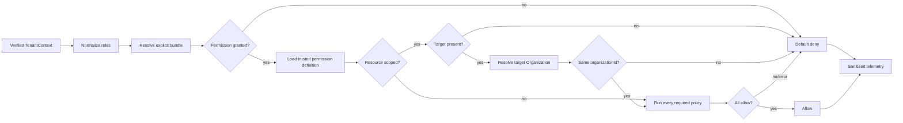

# Authorization V1 and RBAC architecture

**Status:** Implementation in progress — kernel complete, adapters pending
**Milestone:** M4 — Authorization V1
**Style:** Fixed-role RBAC plus tenant-aware resource policies
**Reviewed:** 2026-08-22

## Purpose

Authorization V1 answers: may this verified Organization member perform this operation on this tenant-owned resource?

Permissions are the stable contract. Organization roles are version-controlled permission bundles. Resource policies handle facts roles cannot express, such as tenant ownership and Case assignment. V1 incrementally replaces the numeric `LabRole` hierarchy and UI-oriented access-control helper. Legacy files remain until M5 removal gates pass.

## Ownership boundaries

The reusable kernel owns decision mechanics, trusted permission-definition contracts, role-bundle evaluation, fail-closed policy composition, denial reasons, and telemetry contracts. It is generic over application permission and target-type string unions. The LabOS integration owns the concrete LabOS permission catalog, fixed LabOS bundles, domain policy registrations, fact loaders, and server adapters.

It does not own authentication, membership lifecycle, active-Organization selection, `StaffRoleCategory`, workflow validity, subscriptions, domain mutations, or audit persistence.

For every Better Auth-owned Organization mutation, **both** LabOS Authorization V1 and Better Auth Organization authorization must allow the operation. Tests must keep Better Auth's configured `owner`, `admin`, `manager`, and `staff` access-control roles compatible with the LabOS bundle expectations. Neither authority may be bypassed because the other returned allow.

| Question | Authority |
|---|---|
| Authenticated and active member? | Better Auth plus `TenantContext` |
| Product role? | Normalized, verified `Member.role` |
| Product operation allowed? | Authorization V1 |
| Resource belongs to tenant? | Mandatory resource check plus tenant-scoped query/mutation |
| Assigned to this Case or allowed to affect this member? | Registered policy |
| Operational job? | `LabStaff.roleCategory`; never an RBAC grant |

## Security invariants

1. Default deny applies to unknown roles/permissions, missing facts, and policy errors.
2. Actor and tenant IDs come only from `requireTenantContext()`; client identity, tenant, and role values are untrusted.
3. Every resource decision resolves its Organization through a trusted target resolver and checks it against `actor.organizationId` before domain policy evaluation.
4. UI capabilities never replace server enforcement.
5. `StaffRoleCategory` grants no application access; `staffId` is only a policy fact.
6. Roles are explicit bundles, never a numeric hierarchy.
7. Authorized mutations still include tenant predicates; authorization is not a replacement for safe data access.
8. Public errors are generic. Internal reasons never expose protected payloads.
9. No cross-request decision cache exists in V1, so membership and role changes apply on the next request.
10. Platform administration is a separate actor mode and is out of tenant V1 scope.
11. A resource-required permission without a target, a policy-required permission without a registered policy, or a target type without its trusted resolver denies with high-severity telemetry.
12. A granted bundle and **all** required policies must allow. V1 has no policy expression language, priorities, weights, or allow/deny overrides.
13. Owner and other security-critical mutable invariants are revalidated atomically at mutation time; this is mandatory, not an optimization.

## Contracts

```ts
type AuthorizationActor = {
  userId: string
  memberId: string
  organizationId: string
  memberRoles: readonly OrganizationRole[]
}

type AuthorizationTargetRef = {
  type: ResourceType
  id: string
}

type AuthorizationRequest = {
  actor: AuthorizationActor
  permission: Permission
  target?: AuthorizationTargetRef
}

type PermissionDefinition = {
  permission: Permission
  scope: 'organization' | 'resource'
  requiredPolicies: readonly PolicyId[]
  sensitivity: 'ordinary' | 'sensitive' | 'critical'
}

type AuthorizationDecision =
  | { allowed: true; reason: 'ROLE_PERMISSION' | 'POLICY_ALLOWED' }
  | { allowed: false; reason: AuthorizationDenialReason }

interface AuthorizationService {
  can(request: AuthorizationRequest): Promise<AuthorizationDecision>
  require(request: AuthorizationRequest): Promise<void>
  roleCapabilities(actor: AuthorizationActor, permissions: readonly Permission[]):
    Promise<Readonly<Record<Permission, boolean>>>
}
```

The core target contains identifiers only. It has no `labId`, `staffId`, or caller-supplied attribute bag. A trusted resolver registered for the target type loads its Organization boundary. Typed domain policies load their own security facts through tenant-scoped dependencies.

The LabOS adapter separately derives domain context from verified tenancy:

```ts
type LabOSAuthorizationContext = {
  labId: string
  staffId: string | null
}
```

This context and facts such as Case assignments, Invoice state, or LabStaff linkage never become generic kernel fields.

The adapter derives and injects that context; an action cannot construct it. Policies use typed target references and own their loaders:

```ts
type CaseTarget = { type: 'case'; id: string }

interface CasePolicyFactsLoader {
  loadForTransition(input: {
    actor: AuthorizationActor
    target: CaseTarget
  }): Promise<{
    organizationId: string
    labId: string
    actorStaffId: string | null
    actorStaffActive: boolean
    actorAssigned: boolean
  } | null>
}

type CaseTransitionPolicy = AuthorizationPolicy<CaseTarget>
```

The loader obtains every security-sensitive fact from authoritative storage. The caller supplies only the permission and Case identifier.

Better Auth roles are trimmed, lower-cased, and deduplicated. Recognized roles are `owner`, `admin`, `manager`, and `staff`. Multiple roles produce the union of bundles. Unknown roles grant nothing and are monitored.

Mapping Better Auth's default `member` role to `staff` is an explicitly named, temporary migration adapter, not normalizer behavior. It must be feature-flagged or isolated as `TEMPORARY_MEMBER_TO_STAFF_COMPATIBILITY`, measured, and removed after every existing membership uses an explicit configured role. Better Auth remains configured with the four static custom roles; dynamic access control and persisted runtime roles remain disabled in V1.

`roleCapabilities()` answers only whether the role bundle potentially grants an operation. It never evaluates a resource, target resolver, or domain policy and is non-authoritative UI guidance. `can()`/`require()` with the required target remains the only resource decision API.

## Permission vocabulary

Names use lower-case `<resource>.<action>` strings. They describe operations, never UI pages, HTTP verbs, or roles. Sensitive operations remain separate even if V1 bundles grant them together.

| Area | V1 permissions |
|---|---|
| Case | `case.read`, `case.create`, `case.update`, `case.archive`, `case.assign`, `case.transition`, `case.financials.read`, `case.financials.update` |
| Clinic | `clinic.read`, `clinic.create`, `clinic.update`, `clinic.archive` |
| Dentist | `dentist.read`, `dentist.create`, `dentist.update`, `dentist.archive` |
| Patient | `patient.read`, `patient.create`, `patient.update`, `patient.archive` |
| Catalog | `catalog.read`, `catalog.create`, `catalog.update`, `catalog.archive`, `catalog.delete` |
| Staff | `staff.read`, `staff.create`, `staff.update`, `staff.deactivate`, `staff.schedule.update`, `staff.assign`, `staff.access.invite`, `staff.access.revoke`, `staff.compensation.read`, `staff.compensation.update` |
| Invoice | `invoice.read`, `invoice.create`, `invoice.update`, `invoice.cancel`, `invoice.delete_draft`, `invoice.payment.record`, `invoice.overdue.sync` |
| Payout | `payout.read`, `payout.issue`, `payout.void` |
| Settings | `lab.settings.read`, `lab.settings.update` |
| Membership | `membership.read`, `membership.role.update`, `membership.remove` |
| Billing | `billing.read`, `billing.manage` |

New permissions require review of role assignment, resource policy, audit sensitivity, tests, and migration mapping. Renaming/removal is a contract change.

Trusted definitions are the source of truth for enforcement requirements:

| Permission | Scope | Target | Required policies |
|---|---|---|---|
| `case.create` | Organization | None | LabOS tenant provisioning/context policy |
| `case.update` | Resource | Case ID | Organization boundary, Case update policy |
| `case.transition` | Resource | Case ID | Organization boundary, Case transition policy |
| `invoice.delete_draft` | Resource | Invoice ID | Organization boundary, financial target, draft state |
| `lab.settings.read` | Organization | None | None beyond verified membership |

The implementation catalog defines this metadata beside each permission. Request callers cannot weaken or override it.

## Fixed bundles

V1 stores immutable bundles in TypeScript and introduces no authorization tables or Prisma migration. Custom roles and member overrides are deferred until proven necessary.

Business meanings are fixed before bundle code:

| Role | Business meaning |
|---|---|
| `owner` | Tenant ownership, billing, critical deletion, and every tenant capability. |
| `admin` | Access administration, configuration, and broad operations; not ownership. |
| `manager` | Operational, workforce, and financial management; not membership or ownership administration. |
| `staff` | Basic tenant participation and policy-scoped assigned work. |

| Capability | Owner | Admin | Manager | Staff |
|---|:---:|:---:|:---:|:---:|
| Ordinary tenant reads | Yes | Yes | Yes | Yes, policy-scoped |
| Create/update Cases and clinical records | Yes | Yes | Yes | No |
| Assign staff/manage Case workflow | Yes | Yes | Yes | Assigned transition only |
| Case financials | Yes | Yes | Yes | No |
| Catalog create/update/archive | Yes | Yes | Yes | Read only |
| Supported Catalog hard delete | Yes | No | No | No |
| Staff create/update/deactivate/schedule | Yes | Yes | Yes | No |
| Invite/revoke/update member roles | Yes | Yes, owner safeguards | No | No |
| Compensation | Read/write | Read | Read/write | No |
| Invoice/payment | Full | Full | Full | Read only |
| Payout | Full | Read | Full | No |
| Lab settings | Full | Full | Read | No |
| Billing | Full | Read | Read | No |

These become explicit `Set<Permission>` values, not calculated inheritance. Any intentional difference from current behavior must be recorded and approved in the migration inventory.

## Decision pipeline



Organization-scoped permissions skip target resolution only when their trusted definition says so. Order is fixed: validate request, normalize roles, resolve bundle, load permission definition, enforce target requirement, resolve target Organization, verify the boundary, verify every required policy is registered, run all policies, and allow only if all pass. Missing definition/resolver/registration or any policy error denies and emits high-severity telemetry.

## Required V1 policies

| Policy | Rule |
|---|---|
| Organization boundary | Trusted target resolver maps the identifier to actor `organizationId`; always first. |
| Assigned Case | Staff needs active `staffId` and an active same-Lab assignment for staff-level Case reads/transitions. |
| Case transition | `case.transition` determines who may request it; Workflow later determines whether it is currently valid. |
| Membership target | Same Organization; only an owner may affect an owner; self-target behavior is explicit for each command. |
| Role assignment | The requested role is configured and falls within the actor's explicit grantable-role ceiling. The Staff-access flow never grants `owner`. |
| Staff target | Same Lab; linked Member, if present, belongs to the active Organization. |
| Financial target | All referenced Invoice, Case, Clinic, Staff, assignment, and payout records resolve to actor Lab. |
| Draft deletion | `invoice.delete_draft` additionally requires current draft state. |

Callers supply identifiers, never trusted-looking security attributes. Each typed policy owns its fact loader, which is tenant-scoped, selects minimal columns, and may reuse facts within a request. Policy composition is a deterministic AND.

Owner count, ownership role, financial invariants, and other security-critical mutable facts must be re-read inside the mutation transaction or enforced by a proven concurrency-safe authority. The rule that an Organization must retain an owner is a domain invariant, not merely an authorization-policy fact. For Better Auth mutations that cannot share the application's transaction, use supported hooks/atomic mechanisms and concurrency tests; do not rely on a stale authorization precheck. Last-owner protection may be delegated to Better Auth only after tests prove its behavior under concurrent removal, demotion, and leave operations.

For Staff-access invitations, identical intent means the same Organization, LabStaff, normalized email, and requested role. Repeating identical intent should use Better Auth's idempotent resend behavior. A changed email or role is an authorized replacement operation and must pass the role-assignment ceiling again before the prior invitation is canceled or replaced.

Staff-access invitation and revocation share one immutable, typed role-target policy matrix:

```ts
type StaffAccessTargetRole = Exclude<OrganizationRole, 'owner'>

const STAFF_ACCESS_ROLE_TARGETS = {
  owner: new Set<StaffAccessTargetRole>(['admin', 'manager', 'staff']),
  admin: new Set<StaffAccessTargetRole>(['staff']),
  manager: new Set<StaffAccessTargetRole>(),
  staff: new Set<StaffAccessTargetRole>(),
} satisfies Readonly<
  Record<OrganizationRole, ReadonlySet<StaffAccessTargetRole>>
>
```

This matrix remains private to the policy module and is exposed through an evaluator rather than as mutable Sets. The ceiling is combined with operation-specific policies. Staff-access commands always deny self-targeting, never grant or target `owner`, and never promote, demote, remove, or otherwise mutate ownership. A-125 may load an Owner role only to deny the command. Self-departure and ownership changes are separate future operations such as `membership.leave`, `membership.owner.promote`, and `membership.owner.demote`; generic membership removal and role update also deny Owner targets until those operations are designed and their concurrency behavior is proven.

## Error and monitoring contract

Internal reasons are `AUTHZ_ACTOR_INVALID`, `AUTHZ_ROLE_UNRECOGNIZED`, `AUTHZ_PERMISSION_NOT_GRANTED`, `AUTHZ_PERMISSION_DEFINITION_MISSING`, `AUTHZ_RESOURCE_REQUIRED`, `AUTHZ_RESOURCE_UNEXPECTED`, `AUTHZ_TARGET_TYPE_MISMATCH`, `AUTHZ_TARGET_RESOLVER_MISSING`, `AUTHZ_TARGET_NOT_FOUND`, `AUTHZ_TARGET_RESOLUTION_FAILED`, `AUTHZ_TENANT_MISMATCH`, `AUTHZ_POLICY_NOT_REGISTERED`, `AUTHZ_POLICY_DENIED`, `AUTHZ_POLICY_FACT_MISSING`, `AUTHZ_POLICY_FAILED`, and `AUTHZ_OWNER_INVARIANT`.

Emit `platform.authorization.decision` with outcome, severity, reason, permission, normalized roles, unknown-role count, Organization ID, target type, correlation ID, and duration. Missing trusted definitions/resolvers/policies and resolver/policy failures are high severity. The LabOS adapter may add Lab ID as integration telemetry, not as a kernel field. Never record target IDs, user/member IDs, resource payloads, patient data, invitation tokens, credentials, financial amounts, provider errors, or free-form input.

Shadow divergence has separate categories: `LEGACY_ALLOW_V1_DENY` and the higher-risk `LEGACY_DENY_V1_ALLOW`. Every privilege expansion requires explicit review before enforcement. Approved differences are recorded; zero divergence is not required when removing the old hierarchy is intentional.

Engineering targets to validate are role-only p95 below 2 ms in process and policy evaluation p95 below 25 ms excluding handler work.

## Server integration

Create a permission-aware safe-action client whose metadata requires `permission: Permission`. Trusted permission definitions—not callers—declare organization/resource scope and required policy IDs. The client runs after authentication and tenant resolution. Public/session-only actions use distinct clients, not `permission: null`. During cutover, legacy and permission metadata may coexist, but a declared V1 permission is never silently replaced by a role decision.

Routes call the same service. Pages may use `roleCapabilities()` for potential UI affordances, while underlying commands remain protected. Domain services accept verified actor context or enforce at their application boundary; they never accept a raw client role.

```text
platform/authorization/
  index.ts
  authorization.types.ts
  permissions.ts
  roles.ts
  role-normalizer.ts
  authorization.error.ts
  authorization.monitor.ts
  authorization.service.ts
  policies/
  adapters/

modules/labos-authorization/
  permissions.ts
  roles.ts
  labos-authorization-context.ts
  target-resolvers/
  policies/
  fact-loaders/
```

The generic platform kernel must not import Prisma-generated LabOS models. LabOS fact loaders and registrations live in an integration layer.

## Migration

Current baseline: 131 `requiredLabRole` declarations in `actions/` — 55 Staff, 52 Admin, 14 Manager, 6 Owner, and 4 null. Routes, pages, readers, services, file access, and UI checks also require inventory.

1. Add the domain-independent kernel, trusted permission-definition registry, bundle evaluator, telemetry, and tests without consumers.
2. Add permission middleware and policy registry alongside the legacy gate.
3. Inventory every protected server entry point.
4. Shadow-evaluate representative paths and separately measure both divergence directions.
5. Enforce membership/access first, then finance/destructive actions, then Case/Staff policies, then remaining operations.
6. Replace UI capability projections only after server enforcement.
7. Prove zero runtime legacy consumers before M5 deletion.

Rollback is per slice: restore its still-present legacy enforcement. Never disable both V1 and legacy enforcement. If a rollback restores an intentionally removed legacy capability, such as Manager access to Staff invitation or revocation, it is a known privilege expansion rather than a semantically equivalent fallback. Record and explicitly approve that incident risk, monitor it, and keep the rollback short-lived. No database migration is planned; if schema work emerges, stop and request user approval.

## Tests and definition of done

- [ ] Vocabulary and bundle matrix are approved.
- [ ] The kernel contains no `labId`, `staffId`, Prisma, or LabOS domain types.
- [ ] Every role/permission pair and role-normalization edge case is tested; temporary `member` compatibility is measured and removable.
- [ ] Resource/policy requirements come from trusted permission definitions and missing registration fails closed.
- [ ] Default deny, policy failure, tenant mismatch, and sanitized monitoring are tested.
- [ ] Assigned/inactive Staff, concurrency-safe owner invariants, financial links, and invoice state are tested.
- [ ] Better Auth and LabOS dual-authorization compatibility tests pass for Organization mutations.
- [ ] Two-Organization tests reject foreign resources and verify role changes on the next request.
- [ ] All 131 declarations and all non-action boundaries are inventoried and migrated/classified.
- [ ] Every covered server operation uses the single evaluator.
- [ ] No migrated path uses numeric hierarchy or UI-only authorization.
- [ ] Decision performance and shadow divergence are observable.
- [ ] Legacy artifacts remain only as documented compatibility code for M5.
